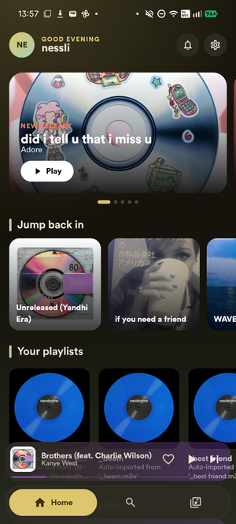
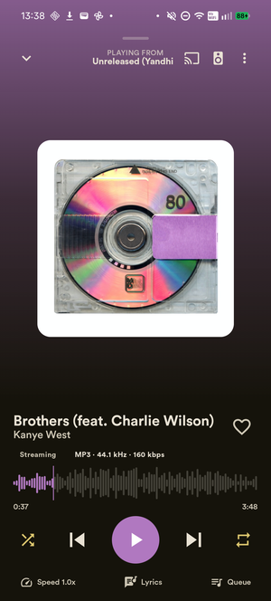
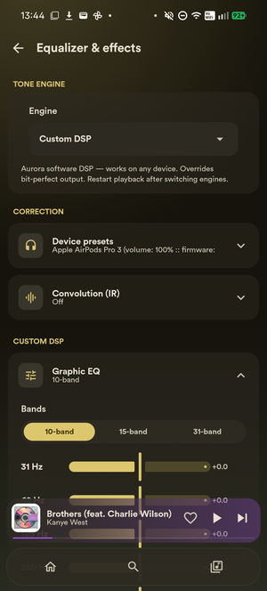
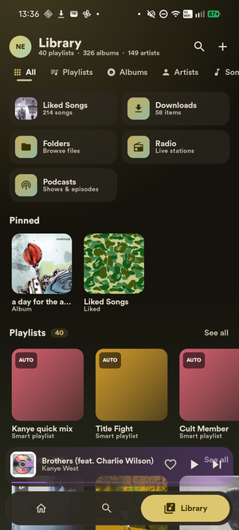
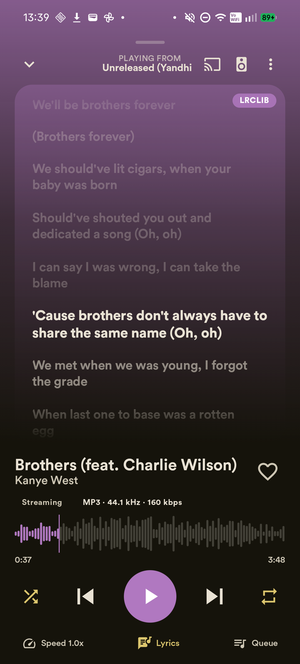
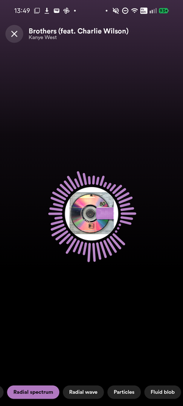
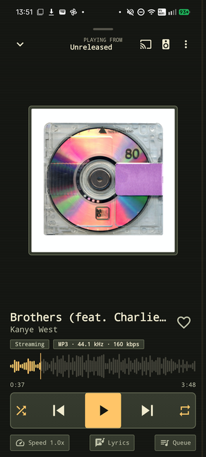
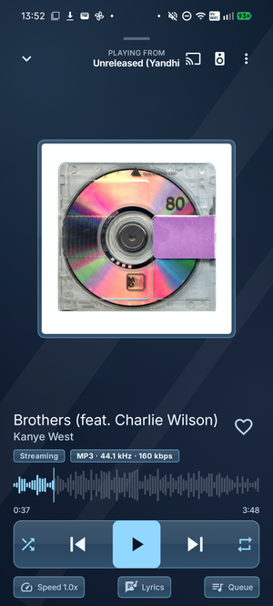
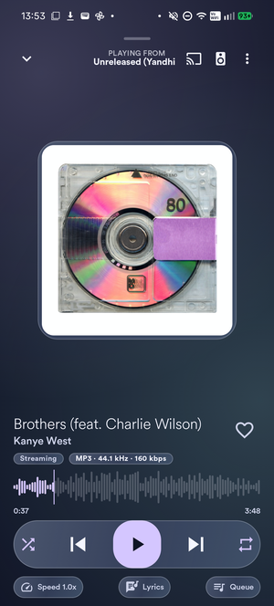

# Aurora Music Player

An Android music player for your local files, home music server, and Green Music App library. Keep your music together, listen offline, and adjust the sound to suit your headphones or speakers.

**[Download APK](https://github.com/nessli420/aurora/releases/latest)** · [Features](#features) · [Screenshots](#screenshots) · [Build from source](#build-from-source) · [Report an issue](https://github.com/nessli420/aurora/issues)

Requires **Android 8.0 or newer** on a 64-bit device. Aurora is actively developed; the source may include changes that are not in the latest release yet.

## Screenshots

<table>
  <tr>
    <td align="center" width="33%"><a href="docs/screenshots/home.webp"></a><br><sub>Home</sub></td>
    <td align="center" width="33%"><a href="docs/screenshots/player.webp"></a><br><sub>Player</sub></td>
    <td align="center" width="33%"><a href="docs/screenshots/equalizer.webp"></a><br><sub>Equalizer</sub></td>
  </tr>
</table>

<details>
<summary>More screenshots</summary>

<table>
  <tr>
    <td align="center" width="33%"><a href="docs/screenshots/library.webp"></a><br><sub>Library</sub></td>
    <td align="center" width="33%"><a href="docs/screenshots/lyrics.webp"></a><br><sub>Lyrics</sub></td>
    <td align="center" width="33%"><a href="docs/screenshots/visualizer.webp"></a><br><sub>Visualizer</sub></td>
  </tr>
  <tr>
    <td align="center" width="33%"><a href="docs/screenshots/theme-retro-player.webp"></a><br><sub>Retro</sub></td>
    <td align="center" width="33%"><a href="docs/screenshots/theme-aero-player.webp"></a><br><sub>Aero</sub></td>
    <td align="center" width="33%"><a href="docs/screenshots/theme-glass-player.webp"></a><br><sub>Glass</sub></td>
  </tr>
</table>

[Browse all screenshots](docs/screenshots). Screenshots are from September 2026; newer builds may look different.

</details>

## Get started

1. Download `Aurora.apk` from the [latest release](https://github.com/nessli420/aurora/releases/latest).
2. Open it on your phone. Allow installation from your browser or file manager if Android asks.
3. Choose a music source and follow the sign-in screen.

| Source | What you need |
| --- | --- |
| **Local files** | Music on your phone and permission to access it. No account needed. |
| **Navidrome / Subsonic / OpenSubsonic** | Your server address, username, and password. |
| **Jellyfin** | Your server address, username, and password. |
| **Green Music App** | Your own app client ID. Aurora reads your library and plays matching audio from YouTube. |

Save several accounts and switch between them in **Settings → Servers & accounts**. To show multiple sources together, open **Settings → Library & sources** and enable **Merge all sources**.

## Features

### Your music

- Browse albums, artists, playlists, songs, and folders. Search across your active library.
- Download music for offline listening and prefer local copies when available.
- Create playlists, import or export M3U playlists, and build playlists that update from your rules.
- Find duplicate tracks, edit supported file tags, and look up missing track details and artwork.
- List collaborations under each artist. Choose which characters or words separate names.
- Listen to internet radio and podcasts, or add your own radio stream.

### Playback

- Gapless playback, crossfade, repeat, shuffle, and an editable queue saved for each account.
- Lyrics, speed and pitch controls, silence skipping, and volume leveling between tracks.
- A sleep timer and a music alarm with its own settings page.
- Automatic transitions between tracks with **Mix**, plus **Mix Studio** for editing them.
- Optional vocal or backing-track separation in Mix Studio. Processing runs on your phone after a one-time model download.
- Android Auto, Chromecast, lock-screen controls, a home-screen widget, and a Quick Settings button.

### Sound controls

Start with a preset for your headphones, earbuds, or speakers, then adjust as much as you want. You can make a small bass change or build and save a complete sound setup.

- **Detailed equalizers.** Each equalizer in the processing rack supports up to 64 adjustable bands. Choose the frequency, how much to boost or cut, and how wide each adjustment should be. Make broad tone changes or target a narrow problem area, with a graph showing the combined result.
- **Tuning from measurements.** Import measurements from tools such as REW or Squig, choose the sound you want to aim for, and let Aurora generate the equalizer settings. Set limits on boosts, cuts, and the number of bands. Adjust bass preference and the balance between darker and brighter sound, then compare the original and predicted response.
- **Separate left and right controls.** Use different corrections for each ear or speaker, or keep them linked. Adjust each channel's volume and timing separately, along with balance and stereo width.
- **Build your own effects chain.** Arrange up to 16 stages in the processing rack, including several equalizers with up to 256 bands in total. Reorder, duplicate, disable, or blend each effect with the original sound. You can also split the audio into separate paths, apply different effects, and mix them back together. Save groups of effects to reuse later.
- **Sound that responds to the music.** Use equalizer adjustments that react to louder passages, control volume changes separately in the bass, mids, and treble, or add distortion for a warmer or rougher sound. Loudness compensation adjusts the tone as you change listening volume.
- **Soften or color the sound.** A de-esser reduces sharp “s” sounds, while a gate quiets low-level noise. Add tape or tube character, extra brightness, or fuller bass.
- **Echo, space, and movement.** Add delay, echoes that alternate between speakers, or reverb. Chorus, flanger, and phaser add movement; tremolo pulses the volume, while vibrato varies the pitch.
- **Import your own correction files.** Load impulse responses—files that describe a sound adjustment—then trim them, adjust their level, and use several in one chain. Keep the originals and save edited versions separately.
- **Save, switch, and share.** Save the whole setup, including its correction files, and export it for another device. Assign presets to headphones or outputs, or create rules that select them by track or source. Manual overrides let you keep the sound you have chosen.
- **Check what changed.** Compare a short section of the same song through two presets at matched volume, or use a blind listening test. **Signal Path** shows active effects, before-and-after levels and frequency graphs, and the output format in use.
- **Estimated listening levels.** Enter your headphone sensitivity and measured DAC and volume data to estimate sound level, with uncertainty shown. Uncalibrated outputs stay unavailable. Optional level samples stay on your device.

The main audio engine uses 64-bit calculations to keep extra precision as effects are combined. There are also controls for output sample rates and audio conversion. Available controls depend on the playback mode; [USB audio](#usb-audio) has its own options and limits.

### Make it yours

- Light, dark, and pure black modes, multiple interface styles, custom colors, and visualizers.
- A local profile with your own display name, avatar, and banner.
- Listening history and statistics for your tracks, albums, and artists.
- Send listening history to Last.fm or ListenBrainz using the first artist from your separator rules. Share your now-playing status on Discord.
- Back up settings, local playlists, likes, history, your local profile, and saved sound setups in one file. Music files and downloads are not included.

## USB audio

Connect a USB DAC and open **Settings → Audio output → USB DAC output**. A DAC is an external audio adapter, such as a USB headphone dongle.

- **Direct:** bypasses Aurora's effects and software volume. Use the DAC's volume controls.
- **Processed:** keeps Aurora's sound settings and software volume active. Crossfade, speed/pitch changes, and silence skipping are unavailable in this mode.
- **If USB is unavailable:** choose to pause or continue through Android's normal output. Pause is the default.

Restart Aurora after changing USB settings. **Signal Path** shows the output in use and any fallback.

USB support is still experimental and varies by phone and DAC. Direct and processed playback have been tested with a **FiiO KA13**. [DSF/DFF files](docs/audio-formats.md) are supported through audio conversion; unchanged DSD output is not supported.

## Network audio

Play through Chromecast, a compatible DLNA receiver, or another Aurora device. Direct Cast keeps the original audio file and bypasses Aurora's effects. Processed output applies your effects before sending the track. Tracks are prepared first, so playback can take a moment to start. Crossfade, gapless transitions, speed changes, and silence skipping are unavailable when sending audio.

To use another Aurora device as a player, enable **Settings → Network audio → Allow remote control** on it. Copy its pairing address and code to the controlling device. Aurora copies the queue before playback, up to 100 tracks and 512 MB, so the receiver can keep playing if the controlling device goes offline. The receiving device uses its own audio settings and output, including a connected USB DAC. Paired access can be revoked at any time.

## Extensions

Install a compatible extension app, then enable it in **Settings → Extensions**. Extensions can add sound presets, read-only music libraries, or tag suggestions. You choose when to load a preset, switch libraries, or apply suggested tags.

Want to build one? The [extension SDK guide](docs/extensions.md) covers API 1, access controls, supported features and the included example app.

## Optional accounts

Local files and server playback do not need any of these. Connect only the services you use.

| Service | Setup |
| --- | --- |
| **Green Music App** | Create an app in the [developer dashboard](https://developer.spotify.com/dashboard), set its redirect to `aurora://spotify`, and enter its client ID on Aurora's sign-in screen. |
| **Last.fm** | Enter your [API key and shared secret](https://www.last.fm/api/account/create) in **Settings → Integrations**, then link your account. |
| **ListenBrainz** | Copy your [user token](https://listenbrainz.org/profile) into **Settings → Integrations**. |
| **AcoustID** | Add an [application API key](https://acoustid.org/new-application) in **Settings → Integrations** to identify tracks from their audio. |
| **Discord** | Connect in **Settings → Integrations**. A [Discord application ID](https://discord.com/developers/applications) and an Imgur client ID are optional for artwork. |

## Help

- **Local music is missing:** allow music and audio access in Android's app permissions.
- **A server will not connect:** check its address and port, and whether your phone can reach it. A server on your home network may need a VPN when you are away.
- **Artist names are split incorrectly:** adjust **Settings → Library & sources → Artist separators**. File tags stay unchanged.
- **USB playback stops:** check the DAC connection and USB permission, then restart Aurora. The default behavior is to pause when USB output is unavailable.
- **An update will not install:** debug and release builds use different signing keys. Back up your data before uninstalling to switch between them.

For a bug report, include your app version, phone, Android version, music source, and the steps that trigger it. For USB issues, include the DAC model. [Open an issue](https://github.com/nessli420/aurora/issues).

## Build from source

<details>
<summary>Requirements and build steps</summary>

Use **JDK 21**, **Android SDK 35**, **NDK 27.0.12077973**, and **CMake 3.22.1**. Build with the included Gradle wrapper.

1. Clone this repository and open it in Android Studio. The native libraries are included; no submodule setup is needed.
2. Set the SDK location in `local.properties` if Android Studio has not created it:

   ```properties
   sdk.dir=/absolute/path/to/Android/sdk
   ```

3. Set up the font. Circular Std is not included in the repository. For a system font, replace the `val Circular = FontFamily(...)` declaration in [Type.kt](app/src/main/java/com/aurora/music/ui/theme/Type.kt) with:

   ```kotlin
   val Circular = FontFamily.SansSerif
   ```

   To use your licensed Circular Std files instead, place them in `app/src/main/res/font/` with these names:

   ```text
   circular_light.otf        circular_light_italic.otf
   circular_book.otf         circular_book_italic.otf
   circular_medium.otf       circular_medium_italic.otf
   circular_bold.otf         circular_bold_italic.otf
   circular_black.otf        circular_black_italic.otf
   ```

4. Point `JAVA_HOME` to JDK 21 and build:

   ```bash
   ./gradlew :app:assembleDebug
   ```

   On Windows, use `gradlew.bat` in place of `./gradlew`. The APK is saved to `app/build/outputs/apk/debug/app-debug.apk`.

For a signed release, configure your own keystore in [app/build.gradle.kts](app/build.gradle.kts), then run `:app:assembleRelease`.

Run the unit tests and code checks with:

```bash
./gradlew :app:testDebugUnitTest :app:lintDebug
```

Device tests are in `app/src/androidTest/`. They use the release build by default and need release signing configured. The app code is in `app/src/main/java/com/aurora/music/`; USB audio code is in `decent/`.

</details>

## Credits and license

Aurora is licensed under [Apache 2.0](LICENSE). Third-party code and assets keep their own licenses.

- [decent-player](https://github.com/Ma145/decent-player) provides the USB audio libraries. See [third-party notices](decent/NOTICE.md).
- [libFLAC](https://github.com/xiph/flac), [Chromaprint](https://github.com/acoustid/chromaprint) with KissFFT, [Jellyfin's FFmpeg decoder](https://github.com/jellyfin/jellyfin-androidx-media), and [JAudiotagger](https://github.com/Adonai/jaudiotagger) provide audio decoding, identification, and tag support.
- [NewPipeExtractor](https://github.com/TeamNewPipe/NewPipeExtractor) resolves YouTube audio. [JSch](https://github.com/mwiede/jsch) provides SFTP support in the bundled USB libraries.
- [MusicBrainz](https://musicbrainz.org) and the [Cover Art Archive](https://coverartarchive.org) provide music information and artwork.
- Vocal separation uses Ultimate Vocal Remover's model and ONNX Runtime. See [model credits and attribution](docs/vocal-separation-attribution.md).
- Built with Jetpack Compose and Media3, alongside Glance, DataStore, Palette, Retrofit, OkHttp, Gson, Coil, Lottie, and the Google Cast SDK.

Aurora is an independent project and is not affiliated with the services or device makers listed here.
