# Aurora Music Player

An Android music player built for everyday listening and detailed audio customization. Enjoy a familiar library, lyrics, downloads and personal listening recaps, with precise equalizers, measurement-based tuning and a full custom effects rack in the same app.

Bring local files, home music servers and YouTube Music together, or browse your Green Music App library in its own mode. Press play with the default sound, choose a headphone preset, or build your own processing chain. No Aurora account is required.

**[Download APK](https://github.com/nessli420/aurora/releases/latest)** · [Features](#features) · [Screenshots](#screenshots) · [Tablet](#tablet) · [Windows](#windows-desktop) · [Linux](#linux-desktop) · [Build from source](#build-from-source) · [Report an issue](https://github.com/nessli420/aurora/issues/new/choose) · [Contribute](CONTRIBUTING.md)

Requires **Android 8.0 or newer** on a 64-bit device. Aurora is actively developed; the source may include changes that are not in the latest release yet.

## At a glance

| Everyday listening | Advanced audio customization |
| --- | --- |
| Local files, home servers and YouTube Music in one library | Graphic and parametric EQ, with up to 64 bands per rack equalizer |
| Lyrics, offline downloads, gapless playback and an editable queue | Up to 16 processing stages, routing and reusable effects chains |
| Recommendations, automatic mixes and personal listening recaps | Measurement-based tuning, impulse responses and separate left/right correction |
| Last.fm, ListenBrainz, Discord and flexible themes | Saved output presets, automatic rules and matched-volume preset comparisons |
| Widgets, Android Auto, sleep timer and music alarms | Signal Path diagnostics, direct or processed USB audio and compatible DSD output |

[Explore everyday playback](#the-everyday-comforts) · [Explore sound controls](#sound-controls)

## Screenshots

<table>
  <tr>
    <td align="center" width="33%"><a href="docs/screenshots/home.webp">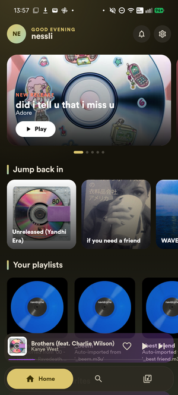</a><br><sub>Home</sub></td>
    <td align="center" width="33%"><a href="docs/screenshots/player.webp">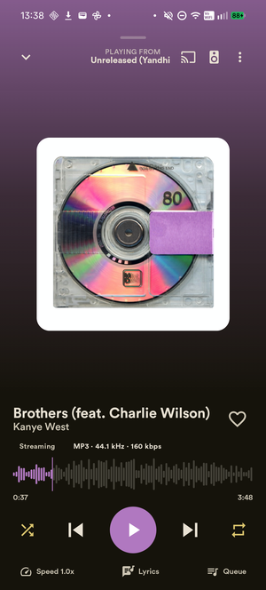</a><br><sub>Player</sub></td>
    <td align="center" width="33%"><a href="docs/screenshots/equalizer.webp">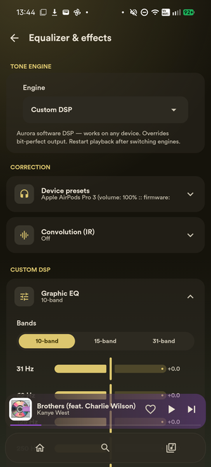</a><br><sub>Equalizer</sub></td>
  </tr>
</table>

<details>
<summary>More screenshots</summary>

<table>
  <tr>
    <td align="center" width="33%"><a href="docs/screenshots/library.webp">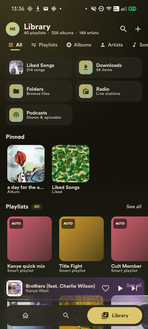</a><br><sub>Library</sub></td>
    <td align="center" width="33%"><a href="docs/screenshots/lyrics.webp">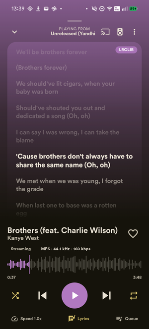</a><br><sub>Lyrics</sub></td>
    <td align="center" width="33%"><a href="docs/screenshots/visualizer.webp">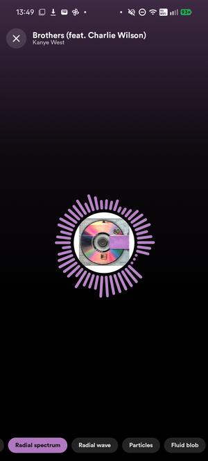</a><br><sub>Visualizer</sub></td>
  </tr>
  <tr>
    <td align="center" width="33%"><a href="docs/screenshots/theme-retro-player.webp">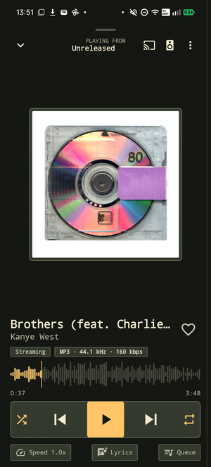</a><br><sub>Retro</sub></td>
    <td align="center" width="33%"><a href="docs/screenshots/theme-aero-player.webp">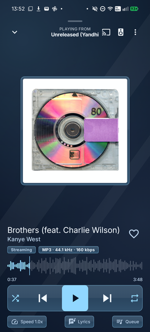</a><br><sub>Aero</sub></td>
    <td align="center" width="33%"><a href="docs/screenshots/theme-glass-player.webp">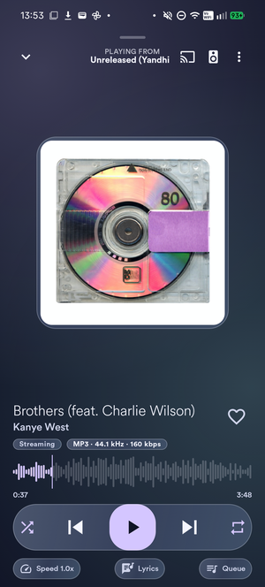</a><br><sub>Glass</sub></td>
  </tr>
</table>

[Browse all screenshots](docs/screenshots). Screenshots are from September 2026; newer builds may look different.

</details>

## Tablet

Aurora adapts to larger screens in portrait and landscape, with a navigation sidebar and a miniplayer across the bottom. Browse your collection while keeping playback controls within reach.

- **More room for your music.** Library and Settings use two-pane layouts when space allows, keeping navigation beside the selected content.
- **Player, queue and lyrics together.** Open queue or lyrics panels while browsing, or use the landscape Now Playing view with an adjustable divider. Lyrics can also fill the screen.
- **A layout you can adjust.** Change dock size, panel controls, spacing, page margins and card sizes in **Settings → Appearance → Tablet Layout**. Customize navigation entries with **Navigation Menu**.
- **Portrait support.** The player rearranges its artwork and controls for a taller screen, and setup adapts to either orientation.

<table>
  <tr>
    <td align="center" width="50%"><a href="docs/screenshots/tablet-home.webp">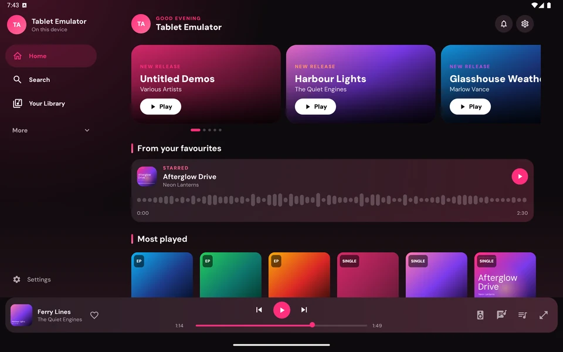</a><br><sub>Home and full-width miniplayer</sub></td>
    <td align="center" width="50%"><a href="docs/screenshots/tablet-player-landscape.webp">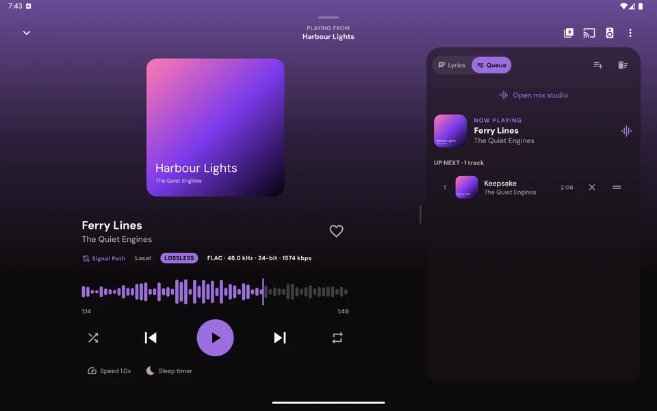</a><br><sub>Landscape player and queue</sub></td>
  </tr>
  <tr>
    <td align="center" width="50%"><a href="docs/screenshots/tablet-settings.webp">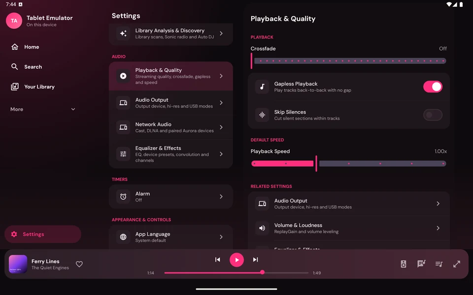</a><br><sub>Split-pane settings</sub></td>
    <td align="center" width="50%"><a href="docs/screenshots/tablet-player-portrait.webp">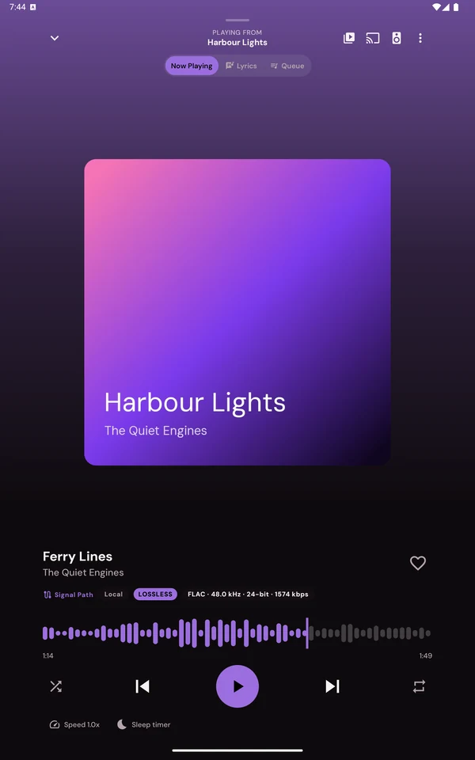</a><br><sub>Portrait player</sub></td>
  </tr>
</table>

Captured from the running app on a Pixel Tablet emulator using a sample local music library. Click a screenshot to view it at full resolution. These layouts are included in the 2.6.2 source; check the latest release for APK availability.

## Windows desktop

Starting with 2.7.0, Aurora also runs on Windows 10 and 11 (64-bit) as a native desktop app. It shares its library, server and sound-processing code with the Android app, so the same equalizers, effects rack and presets shape what you hear, in a layout made for a mouse, keyboard and wide windows.

- **Your music on your PC.** Add music folders from your drives, or sign in to Navidrome/Subsonic, Jellyfin or Plex. Local folders are scanned for tags, cover art and ReplayGain.
- **Built for the desktop.** A sidebar with your pinned items and playlists, grids that fill the window, a player bar with a volume slider, and queue and lyrics panels beside the page. Right-click songs for more actions.
- **Aurora's sound engine.** Playback decodes with FFmpeg and runs through Aurora's own DSP chain, with the same equalizers, rack, convolution and ReplayGain as on Android. Gapless playback and crossfade are included.
- **Bit-perfect output.** Play through the shared Windows mixer, or switch to exclusive mode so Aurora sets the device's sample rate and bit depth itself. With processing off and volume at 100%, the audio reaches your DAC unchanged, and **Signal Path** shows every stage along the way.
- **Fits into Windows.** Media keys and the Windows media overlay control playback, the title bar follows your theme and accent colour, and Aurora can stay in the system tray when you close the window. Press Space to play or pause, Ctrl+←/→ to skip, Ctrl+F to search and F11 for a full-screen player.

Download `Aurora-2.8.0.msi` or the `.exe` installer from the [latest release](https://github.com/nessli420/aurora/releases/latest). Java is included, so nothing else needs installing. The installer is not code-signed yet, so Windows SmartScreen may ask you to confirm the first launch.

The desktop app is new, and some Android features are not available there yet: YouTube Music, Green Music App, internet radio, podcasts, the tag editor, Cast and network output, DSD output, alarms and extensions. Playback speed also changes pitch for now.

## Linux desktop (BETA)

The same desktop app runs on 64-bit (x86_64) Linux distributions with glibc 2.35 or newer, such as Ubuntu 22.04 and Debian 12 or later. Java is included in every package.

| Package | Install |
| --- | --- |
| Debian, Ubuntu and derivatives | `sudo apt install ./aurora_2.8.0_amd64.deb` |
| Fedora | `sudo dnf install ./aurora-2.8.0-1.x86_64.rpm` |
| openSUSE | `sudo zypper install ./aurora-2.8.0-1.x86_64.rpm` |
| Any distribution (AppImage) | `chmod +x Aurora-2.8.0-x86_64.AppImage`, then run it. If it does not start, install your distribution's FUSE package or run it with `--appimage-extract-and-run`. |

The packages add Aurora to your app menu. Media keys and the desktop's media widget control playback through MPRIS, and Aurora keeps the computer awake while music plays. Server passwords are protected by your keyring (GNOME Keyring, KWallet or another Secret Service provider); without one, they are only remembered until Aurora closes. **Close to tray** appears only on desktops with a system tray, which on GNOME needs the AppIndicator extension.

**Exclusive mode on Linux.** In shared mode Aurora plays through PipeWire or PulseAudio. Exclusive mode opens the sound card directly through ALSA, so pick a specific device under **Output device** rather than the PipeWire/PulseAudio entry. The sound server usually holds the card while it is in use and lets it go a few seconds after its last sound stops, so Aurora waits up to about seven seconds for it. If the card stays busy, Aurora plays in shared mode and says why. Stop other audio or switch the card's profile to **Off** in your sound settings, then turn exclusive mode off and on again.

## Get started

1. Download `Aurora.apk` from the [latest release](https://github.com/nessli420/aurora/releases/latest).
2. Open it on your phone. Allow installation from your browser or file manager if Android asks.
3. Choose a music source and follow the sign-in screen.

| Source | What you need |
| --- | --- |
| **Local files** | Music on your phone and permission to access it. No account needed. |
| **Navidrome / Subsonic / OpenSubsonic** | Your server address, username, and password. |
| **Jellyfin** | Your server address, username, and password. |
| **Plex** | Your Plex Media Server address and an [X-Plex-Token](https://support.plex.tv/articles/204059436-finding-an-authentication-token-x-plex-token/). |
| **Green Music App** | Your own app client ID. Aurora reads your library and plays matching audio from YouTube. |
| **YouTube Music** | Sign in with your Google account inside Aurora. No Google Cloud project or API key needed. |

Save several accounts and switch between them in **Settings → Servers & accounts**. To combine local files, Navidrome/Subsonic, Jellyfin, Plex and YouTube Music, open **Settings → Library & sources**, enable **Merge all sources**, and choose the included accounts. Green Music App stays standalone.

Plex connects directly to your server (usually port `32400`) and includes every music library accessible to the token. Use the server address rather than `app.plex.tv`. Plex likes use ratings: four or five stars count as liked; liking sets five stars and unliking clears the rating. Shared-library permissions still apply to playlist changes.

Create, rename and delete regular Plex playlists, and add or remove their tracks. Smart playlists remain playable, with membership controlled by Plex. Aurora also shows server recommendation shelves and lyrics. Radio uses stations offered by your server, then sonic matches or artist radio, with a shuffled-library fallback. Sonic features depend on [Plex Pass and completed server analysis](https://support.plex.tv/articles/sonic-analysis-music/).

With YouTube Music included, Home opens your regular library feed; the button beside the notification bell switches to YouTube Music recommendations and mixes. Search offers separate **Local & servers** and **YouTube Music** results. When playback starts, Aurora checks for the same recording in your included libraries and downloads, follows your source priority, and prefers higher-quality copies within each tier. It checks that a copy can be opened before choosing it; otherwise it plays from YouTube Music. Matching uses the song title and artist, allowing featured credits and extra artist credits to differ. Missing duration or explicit tags do not block a match. Duration helps choose between multiple copies; named versions such as live, remix and slowed remain separate. Album order and YouTube likes stay attached to the original catalogue entry. All selected audio uses Aurora’s native playback and DSP path.

### YouTube Music

Connect your Google account to browse your YouTube Music library and personalized home feed. Home includes the mixes, recommended songs, albums and community playlists returned for your account, with more sections loading as you scroll.

- Play songs, albums, singles and EPs, playlists, and live broadcasts.
- Choose **Audio** or **Video** in the expanded player when a video track is available. Switching keeps your playback position; audio continues when the video screen closes.
- Live broadcasts show **LIVE**. Regular tracks and music videos show their duration and seek controls once loaded.
- Custom DSP, EQ and convolution remain available through Aurora's native audio player. Direct and bit-perfect output still bypass processing.

YouTube streams are lossy, and some uploaded, age-restricted, regional or account-restricted content may be unavailable. Server ReplayGain metadata is not supplied. Listening history sync can report playback to your connected Google account, subject to its history settings. The integration is unofficial and its availability can change. See the [YouTube Music guide](docs/youtube-music.md) for sign-in, account storage and playback details.

## Features

### Your collection and discoveries

- Browse albums, artists, playlists, songs, and folders. Search across your active library.
- Download music for offline listening and prefer local copies when available.
- Create playlists, import or export M3U playlists, and build playlists that update from your rules.
- Find duplicate tracks, edit supported file tags, and look up missing track details and artwork.
- List collaborations under each artist. Choose which characters or words separate names.
- Listen to internet radio and podcasts, or add your own radio stream.

### The everyday comforts

- Gapless playback, crossfade, repeat, shuffle, and an editable queue saved for each account.
- Lyrics in the player, with synchronized words when timed lyrics are available.
- Speed and pitch controls, silence skipping, and volume leveling between tracks.
- A sleep timer and a music alarm with its own settings page.
- Automatic transitions between tracks with **Mix**, plus **Mix Studio** for editing them.
- Optional vocal or backing-track separation in Mix Studio. Processing runs on your phone after a one-time model download.
- Android Auto, Chromecast, lock-screen controls, a home-screen widget, and a Quick Settings button.

### Sound controls

Tune headphones, earbuds or speakers with a preset, precise manual controls or imported measurements. Aurora’s custom DSP supports complete processing chains as well as quick tone adjustments.

- **Build your sound:** graphic and parametric EQ, up to 16 rack stages, dynamics, spatial effects and convolution.
- **Match your equipment:** measurement-based correction, independent left/right tuning and saved output presets.
- **Inspect and compare:** Signal Path, matched-volume comparisons and blind listening tests.

<details>
<summary>Explore the advanced sound tools</summary>

Everyday controls stay in Settings. Open **Advanced audio** for the processing rack, measurement tuning, correction files, preset comparisons, rules and listening calibration.

- **Detailed equalizers.** Each equalizer in the processing rack supports up to 64 adjustable bands. Choose the frequency, how much to boost or cut, and how wide each adjustment should be. Make broad tone changes or target a narrow problem area, with a graph showing the combined result.
- **Tuning from measurements.** Import measurements from tools such as REW or Squig, choose the sound you want to aim for, and let Aurora generate the equalizer settings. Set limits on boosts, cuts, and the number of bands. Adjust bass preference and the balance between darker and brighter sound, then compare the original and predicted response.
- **Separate left and right controls.** Use different corrections for each ear or speaker, or keep them linked. Adjust each channel's volume and timing separately, along with balance and stereo width.
- **Build your own effects chain.** Arrange up to 16 stages in the processing rack, including several equalizers with up to 256 bands in total. Reorder, duplicate, disable, or blend each effect with the original sound. You can also split the audio into separate paths, apply different effects, and mix them back together. Save groups of effects to reuse later.
- **Sound that responds to the music.** Use equalizer adjustments that react to louder passages, control volume changes separately in the bass, mids, and treble, or add distortion for a warmer or rougher sound. Loudness compensation adjusts the tone as you change listening volume.
- **Soften or color the sound.** A de-esser reduces sharp “s” sounds, while a gate quiets low-level noise. Add tape or tube character, extra brightness, or fuller bass.
- **Echo, space, and movement.** Add delay, echoes that alternate between speakers, or reverb. Chorus, flanger, and phaser add movement; tremolo pulses the volume, while vibrato varies the pitch.
- **Import your own correction files.** Load impulse responses—files that describe a sound adjustment—then trim them, adjust their level, and use several in one chain. Keep the originals and save edited versions separately.
- **Save, switch, and share.** Save the whole setup, including its correction files, and export it for another device. Assign presets to headphones or outputs, or create rules that select them by track or source. Manual overrides let you keep the sound you have chosen.
- **Check what changed.** Compare a short section of the same song through two presets at matched volume, or use a blind listening test. **Signal Path** shows active effects, before-and-after levels and frequency graphs, and the output format in use.
- **Estimated listening levels.** Enter your headphone sensitivity and measured DAC and volume data to estimate sound level, with uncertainty shown. Uncalibrated outputs stay unavailable. Optional level samples stay on your device.

The main audio engine uses 64-bit calculations to keep extra precision as effects are combined. There are also controls for output sample rates and audio conversion. Integer output offers TPDF or noise-shaped dither; noise shaping moves conversion noise toward higher frequencies. Available controls depend on the playback mode; [USB audio](#usb-audio) has its own options and limits.

</details>

### Listening history and recaps

Your listening story is part of the player, without needing Last.fm or another service.

- **Choose your period.** Revisit a day, week, month or year, or look at all-time listening from Statistics.
- **Find your favourites.** Rank artists, albums and songs by plays or minutes. See total listening time, play counts and active days.
- **See the patterns.** Explore listening calendars, time-of-day patterns and comparisons with the previous period. Current periods are marked as in progress and compared with the full previous period.
- **Catch up from Home.** The notification bell opens a full-screen inbox of completed recaps.
- **Keep a picture.** Save your top five artists and songs with listening totals in Midnight, Paper or Aurora style.

New history records actual listening time. Older entries may use estimated durations, which the recap identifies.

**Listening history sync** in **Settings → Gestures & behaviour** reports playback to supported Navidrome/Subsonic, Jellyfin, Plex and YouTube Music accounts. Private sessions stop reporting. Offline plays are not uploaded later. In merged libraries, reports follow the source actually playing; a preferred server copy updates that server instead of Google.

### Integrations that fit your music life

Each connection is optional and managed in **Settings → Integrations**.

| Integration | What it adds | Setup |
| --- | --- | --- |
| **Last.fm** | Now-playing updates and scrobbles to your listening profile. | Your own API key and shared secret, then account linking. |
| **ListenBrainz** | Playing-now updates and a record of your listens. | Your ListenBrainz user token. |
| **Discord** | A listening activity with your current track. Choose the artist, song or Aurora as its name, and show or hide album details. | Connect your account; add a Discord application ID for artwork. |
| **AcoustID** | Identify a track by its audio when filenames or tags are incomplete. | Your own application API key. |
| **MusicBrainz & Cover Art Archive** | Look up recording details and missing artwork, with suggestions to review before applying. | Available through the metadata tools. |

Last.fm and ListenBrainz use the first artist from your separator rules for consistent credits. Both have independent enable switches. Discord follows the latest track when you skip; local or private-server cover images can use a configured Imgur upload. That uploads those images to an external service. Turning off **Show album** also removes the artwork caption.

See [optional account setup](#optional-accounts) for the relevant links and sign-in steps. Aurora’s own history and recaps work without these connections.

### Make it yours, keep it yours

- Light, dark and pure black modes, custom colors and visualizers. Retro, Aero and Glass change the interface’s controls and surfaces as well as its palette.
- A local profile with your own display name, avatar and banner.
- Saved accounts and per-account queues, so switching libraries feels familiar.
- A single backup for settings, local playlists, likes, history, your local profile and saved sound setups. Music files and downloads are not included; Google sessions are excluded.

## DSD and SACD

- **DSF and DFF:** play mono or stereo DSD64–1024 files. Aurora converts to PCM by default, so your usual sound settings still work.
- **DST-compressed DFF:** supports unsegmented mono/stereo DSD64. Other compression layouts are not supported yet.
- **SACD ISO:** import stereo tracks from **Settings → Library & sources → Import SACD image**, without extracting the whole image. This is experimental; broader compatibility with real disc images is still unverified. The same DST limits apply.

DSD files cannot currently use network output. Multichannel DSD and PCM-to-DSD conversion are not supported. See [supported formats and limits](docs/audio-formats.md).

## USB audio

Connect a USB DAC and open **Settings → Audio output → USB DAC output**. A DAC is an external audio adapter, such as a USB headphone dongle.

- **Direct:** bypasses Aurora's effects and software volume. Use the DAC's volume controls.
- **Processed:** keeps Aurora's sound settings and software volume active. Crossfade, speed/pitch changes, and silence skipping are unavailable in this mode.
- **If USB is unavailable:** PCM playback can pause or continue through Android's normal output. Pause is the default. Raw DSD always stops if its USB route is unavailable.

Restart Aurora after changing USB settings. **Signal Path** shows the active format, USB connection details, and any fallback or output error.

For unchanged DSD, choose **Direct → DSD files → DoP or Native**. Both send DSD to a compatible DAC without converting it to PCM. Effects and software volume are bypassed.

USB support varies by phone and DAC. The **FiiO KA13** has been tested with direct and processed PCM, native DSD64–256, and DoP DSD64–128. DSD64 passed listening checks in both modes; higher-rate checks covered data transfer and playback controls.

**Experimental DSD** enables other DACs and raw output up to DSD1024. It is off by default. Higher-rate hardware support is untested, and a DAC's advertised DSD rate alone does not guarantee compatibility. Disconnect headphones until the DAC confirms DSD mode, then start at low DAC volume. Include your DAC model, DSD rate, output mode and Signal Path report when reporting results.

## Network audio

Play through Chromecast, a compatible DLNA receiver, or another Aurora device. Direct Cast keeps the original audio file and bypasses Aurora's effects. Processed output applies your effects before sending the track. Tracks are prepared first, so playback can take a moment to start. Crossfade, gapless transitions, speed changes, and silence skipping are unavailable when sending audio.

To use another Aurora device as a player, enable **Settings → Network audio → Allow remote control** on it. Copy its pairing address and code to the controlling device. Aurora copies the queue before playback, up to 100 tracks and 512 MB, so the receiver can keep playing if the controlling device goes offline. The receiving device uses its own audio settings and output, including a connected USB DAC. Paired access can be revoked at any time.

## Extensions

Install a compatible extension app, then enable it in **Settings → Advanced audio → Extensions**. Extensions can add sound presets, read-only music libraries, or tag suggestions. You choose when to load a preset, switch libraries, or apply suggested tags.

Want to build one? The [extension SDK guide](docs/extensions.md) covers API 1, access controls, supported features and the included example app.

## Optional accounts

Local files and server playback do not need any of these. Connect only the services you use.

| Service | Setup |
| --- | --- |
| **Green Music App** | Create an app in the [developer dashboard](https://developer.spotify.com/dashboard), set its redirect to `aurora://spotify`, and enter its client ID on Aurora's sign-in screen. |
| **YouTube Music** | Choose **Settings → Servers & accounts → Add another account → YouTube Music**, then sign in with Google. Complete any verification and tap **Connect this account**. No developer setup required. |
| **Last.fm** | Enter your [API key and shared secret](https://www.last.fm/api/account/create) in **Settings → Integrations**, then link your account. |
| **ListenBrainz** | Copy your [user token](https://listenbrainz.org/profile) into **Settings → Integrations**. |
| **AcoustID** | Add an [application API key](https://acoustid.org/new-application) in **Settings → Integrations** to identify tracks from their audio. |
| **Discord** | Connect in **Settings → Integrations**. A [Discord application ID](https://discord.com/developers/applications) is needed for artwork; configure an Imgur client ID to publish local or private-server covers. |

## Help

- **Local music is missing:** allow music and audio access in Android's app permissions.
- **A server will not connect:** check its address and port, and whether your phone can reach it. A server on your home network may need a VPN when you are away.
- **Google verification stays open:** after completing it, tap **Continue to YouTube Music**, then **Connect this account**. If a saved session expires, reconnect in **Servers & accounts**.
- **Artist names are split incorrectly:** adjust **Settings → Library & sources → Artist separators**. File tags stay unchanged.
- **USB playback stops:** check the DAC connection and USB permission, then restart Aurora. The default behavior is to pause when USB output is unavailable.
- **An update will not install:** debug and release builds use different signing keys. Back up your data before uninstalling to switch between them.

Found a bug or have a feature idea? [Choose an issue form](https://github.com/nessli420/aurora/issues/new/choose). For bugs, include your build, device and steps to reproduce. For audio problems, add the output device and Signal Path details if available.

## Contributing

Bug reports, code fixes, feature ideas and documentation improvements are welcome. Read [Contributing to Aurora](CONTRIBUTING.md) for setup, checks and pull request guidelines.

## Build from source

<details>
<summary>Requirements and build steps</summary>

Use **JDK 21**, **Android SDK 35**, **NDK 27.0.12077973**, and **CMake 3.22.1**. Build with the included Gradle wrapper.

1. Clone this repository and open it in Android Studio. The native libraries are included; no submodule setup is needed.
2. Set the SDK location in `local.properties` if Android Studio has not created it:

   ```properties
   sdk.dir=/absolute/path/to/Android/sdk
   ```

3. Point `JAVA_HOME` to JDK 21 and build:

   ```bash
   ./gradlew :app:assembleDebug
   ```

   On Windows, use `gradlew.bat` in place of `./gradlew`. The APK is saved to `app/build/outputs/apk/debug/app-debug.apk`.

For a signed release, configure your own keystore in [app/build.gradle.kts](app/build.gradle.kts), then run `:app:assembleRelease`.

DM Sans, Plus Jakarta Sans, and Manrope are bundled under the SIL Open Font License. No separate font setup is needed. Choose a typeface in **Settings → Appearance**; the Aurora and Glass themes use DM Sans by default, while Retro and Aero retain their system fonts. The original licenses are available in **Settings → About → Font licenses** and [font notices](app/src/main/assets/font_licenses/README.md).

Run the unit tests and code checks with:

```bash
./gradlew :app:testDebugUnitTest :app:lintDebug
```

Device tests are in `app/src/androidTest/`. They use the release build by default and need release signing configured. The app code is in `app/src/main/java/com/aurora/music/`; USB audio code is in `decent/`.

**Windows desktop app.** Also install Visual Studio 2022 or newer (or its Build Tools) with the C++ desktop workload, which provides MSVC and the Windows SDK, plus CMake. Gradle builds the native audio library automatically. Run the app, or create the MSI and EXE installers in `desktop/build/compose/binaries/main/`:

```bash
./gradlew :desktop:run
./gradlew :desktop:packageDistributionForCurrentOS
```

**Linux desktop app.** Install a JDK 21 such as Temurin, CMake, a C++ compiler and the ALSA headers (`libasound2-dev` or `alsa-lib-devel`). Build the `.deb`, `.rpm` and AppImage with `./gradlew :desktop:packageDeb :desktop:packageRpm :desktop:packageAppImage`; this needs `dpkg-dev` and `rpm`, and the AppImage step downloads a pinned `appimagetool`. The packages bundle the JDK that Gradle runs on, so use a vendor build such as Temurin: a distribution's own JDK links system libraries that other distributions name differently. The **Linux packages** workflow in GitHub Actions builds all three.

Code shared by both apps is in `core/`, the desktop app in `desktop/`, and the native Windows audio and media controls in `native/`. Run their tests with `./gradlew :core:test :desktop:test`.

</details>

## Credits and license

Aurora is licensed under [Apache 2.0](LICENSE). Third-party code and assets keep their own licenses.

- [decent-player](https://github.com/Ma145/decent-player) provides the USB audio libraries. See [third-party notices](decent/NOTICE.md).
- [libFLAC](https://github.com/xiph/flac), [Chromaprint](https://github.com/acoustid/chromaprint) with KissFFT, [Jellyfin's FFmpeg decoder](https://github.com/jellyfin/jellyfin-androidx-media), and [JAudiotagger](https://github.com/Adonai/jaudiotagger) provide audio decoding, identification, and tag support.
- DST decoding derives from Peter Ross's FFmpeg decoder through DSD-Nexus. See the [decoder notice and license](app/src/main/cpp/dst/NOTICE.md).
- [NewPipeExtractor](https://github.com/TeamNewPipe/NewPipeExtractor) resolves YouTube audio, video and live streams. [JSch](https://github.com/mwiede/jsch) provides SFTP support in the bundled USB libraries.
- [MusicBrainz](https://musicbrainz.org) and the [Cover Art Archive](https://coverartarchive.org) provide music information and artwork.
- Vocal separation uses Ultimate Vocal Remover's model and ONNX Runtime. See [model credits and attribution](docs/vocal-separation-attribution.md).
- Built with Jetpack Compose and Media3, alongside Glance, DataStore, Palette, Retrofit, OkHttp, Gson, Coil, Lottie, and the Google Cast SDK.
- The Windows app is built with [Compose Multiplatform](https://github.com/JetBrains/compose-multiplatform) and decodes audio with [FFmpeg](https://ffmpeg.org) (LGPL) through [JavaCPP](https://github.com/bytedeco/javacpp-presets).

Aurora is an independent project and is not affiliated with the services or device makers listed here.
